# 企业流程审批系统 — 用户使用手册

> 版本 1.1 | 2026-07-31
>
> 适用角色：所长 / 普通用户 / 系统管理员

---

## 一、系统概述

### 1.1 这个系统是干什么的

企业流程审批系统是一个**以流程驱动项目**的业务管理平台。你可以把它理解为：

- 所长**设计一条审批流程**（比如"设计图纸→校对→审核→批准"）
- 发起时指定每个节点的负责人、校验人、审批人
- 系统自动推动流程前进，每个环节的人收到任务、执行操作
- 所有文件自动存档，谁在什么时候做了什么都有完整日志

> 📌 和传统 OA 请假系统的区别：请假是单人审批一次过；这里是**多节点流水线**，每个节点有独立的上传、校验、审批、签名环节。

### 1.2 三种角色能做什么

| 角色 | 核心职责 | 能看到什么 |
|------|---------|-----------|
| **所长** | 设计流程模板、发起项目、终止项目、终审 | 项目管理、方案管理、流程设计器、个人中心 |
| **普通用户** | 执行节点任务、上传文件、校验、审批 | 个人中心（我的待办/校验/审批/批准） |
| **系统管理员** | 维护用户、组织、角色、系统配置 | 系统管理（无个人中心，不参与业务） |

> 📌 一个人可以有多个角色。比如所长也可以被分配去做某个节点的审批人——这时他要像普通用户一样完成审批操作（详见第三章 3.8 节）。

---

## 二、快速入门

### 2.1 登录与首次改密码

1. 打开浏览器，访问系统地址（由管理员提供）
2. 输入管理员给你的用户名和初始密码，点击「登录」

> 📌 **初始密码**：新用户的初始密码由系统管理员设定，首次登录后强制修改密码。管理员创建账号时会将初始密码告知用户。

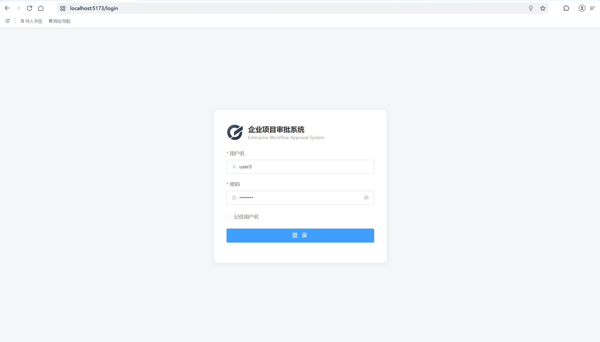

3. **首次登录强制改密码**：系统会弹出修改密码窗口
4. 新密码要求：至少 8 位，包含字母和数字，**不能与用户名相同**

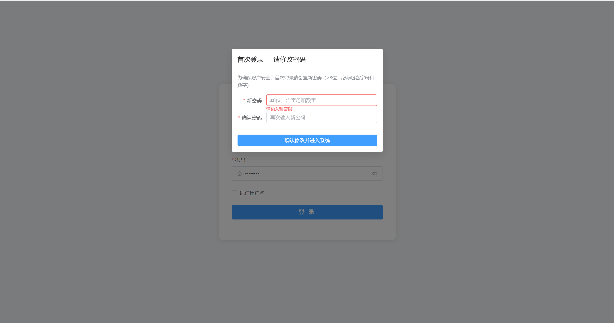

5. 修改成功后进入首页

### 2.2 首页仪表盘怎么看

登录后看到的首页分为以下几个区域（从上到下）：

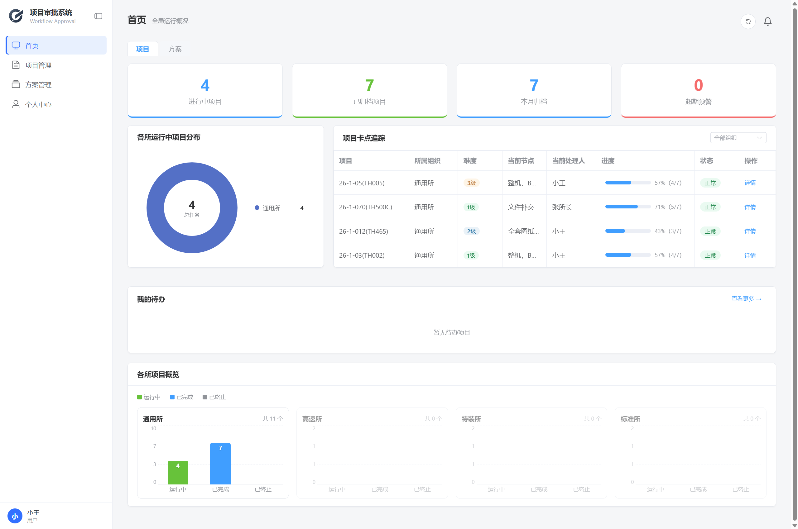

**① 项目/方案 Tab 切换**：切换查看「项目」和「方案」两类流程，下方数据全部联动

**② 统计卡片**：4 张卡片——进行中、已归档、本月归档、超期预警

**③ 饼图 + 卡点追踪（并排）**：左侧环形图展示各所运行中流程分布，点击扇区可跳转对应组织；右侧表格列出超期和临期节点，标红标黄

**④ 我的待办列表**：列出你当前所有待处理项（任务/校验/审批/批准），头部显示「共 N 条 · 紧急 X 条」，点击「处理」直接跳转

**⑤ 各所项目概览柱状图**：按组织分组展示运行中/已完成/已终止的流程数量

### 2.3 发起你的第一个项目（所长）

1. 进入「项目管理」→ 点击所属组织卡片 → 点击「发起项目」
2. 选择模板 → 填写业务信息 → 进入设计器确认节点配置 → 发起

> 📌 完整步骤和字段说明见 [3.2 发起项目实例](#32-发起项目实例)。

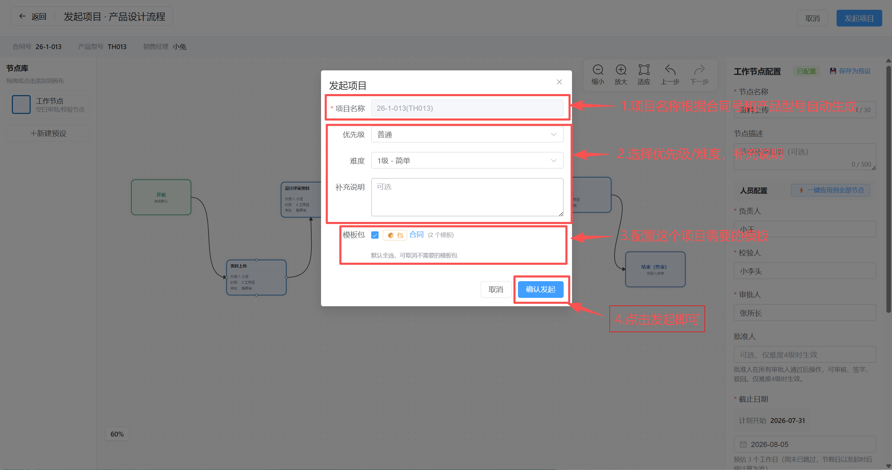

---

## 三、所长篇

> 📌 所长是系统的核心角色：设计模板 → 发起项目 → 跟踪进度 → 终止异常。下面按实际使用顺序编排。

### 3.0 典型工作流

一次完整的项目管理周期如下：

```
设计模板（3.1）
  → 发起项目实例（3.2）
    → 各节点负责人执行任务（第四章）
      → 查看项目进度（3.3）
        → 项目完成归档 or 异常终止（3.4）
```

日常维护操作：紧急换人（3.5）、修改优先级（3.6）、补交文件（4.6）。

---

### 3.1 设计流程模板

> 📌 流程模板 = 项目的"模具"。一个模板可以被多次使用，发起时自动复制节点配置。

#### 3.1.1 创建空白模板

1. 点击「项目管理」→ 进入你的组织卡片 → 点击「新建模板」

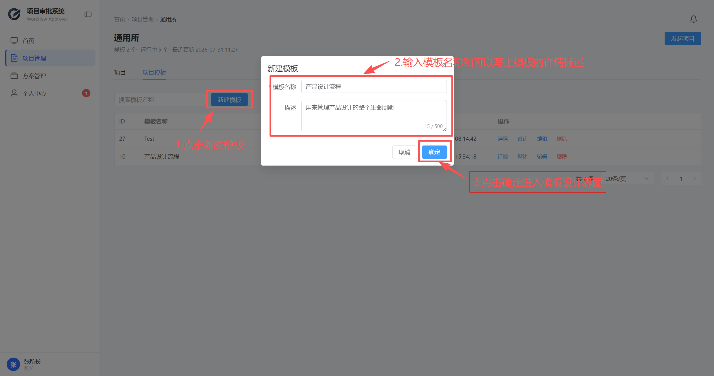

2. 填写模板名称和描述，点击「创建」

#### 3.1.2 编辑器界面介绍

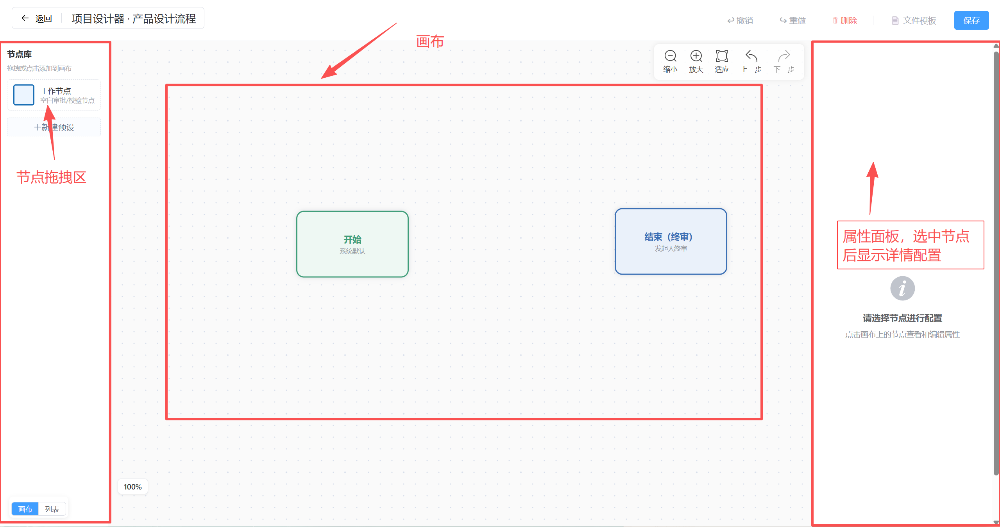

| 区域 | 位置 | 说明 |
|------|------|------|
| **节点库** | 左侧 | 基础工作节点 + 已保存的节点预设。点击或拖拽添加到画布 |
| **画布** | 中间 | 所有节点和连线在此排列。系统已自动生成开始/结束节点 |
| **属性面板** | 右侧 | 选中节点后显示配置项（名称、人员、时限、文件、签名等） |
| **顶部工具栏** | 左上角 | 「保存设计」按钮（含自动校验）；右上角可切换画布/列表视图 |

> 💡 节点库底部有「新建预设」按钮，可以把常用节点配置保存下来反复使用（详见 [3.1.5](#315-节点预设)）。

#### 3.1.3 添加和配置节点

1. 从左侧拖拽「工作节点」到画布

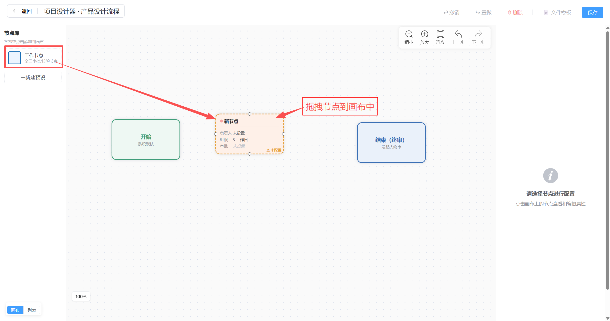

2. 选中画布上的节点，右侧属性面板出现配置项：

| 配置项 | 说明 |
|--------|------|
| **节点名称** | 如"初步设计"、"校对"、"审核" |
| **负责人** | 谁来完成这个节点的具体工作 |
| **校验人** | 指定一人校验（可跳过：不指定则无校验环节） |
| **审批人** | 指定一人审批，全部通过即进入下一节点 |
| **批准人** | 仅难度 4 级需要——所有审批通过后还要批准人签阅 |
| **完成时限** | 工作日内完成的天数 |
| **要求文件** | 开启后节点负责人必须上传文件才能提交 |
| **文件分类** | 开启后可设置多个文件夹，规定文件分类提交 |
| **要求签名** | 各角色提交时是否需要签名插入 PDF |

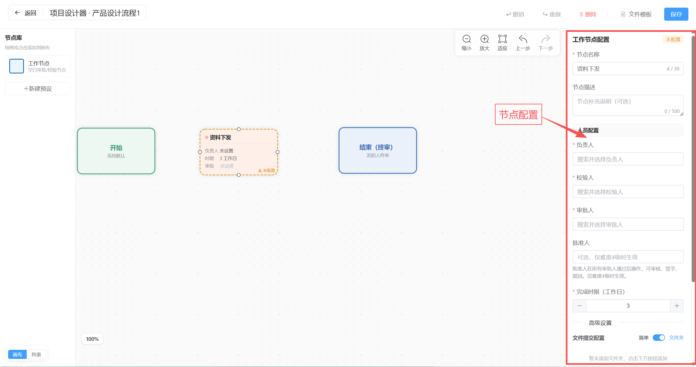

3. 连线：鼠标移到节点底部的小圆点，拖到下一个节点即可连线

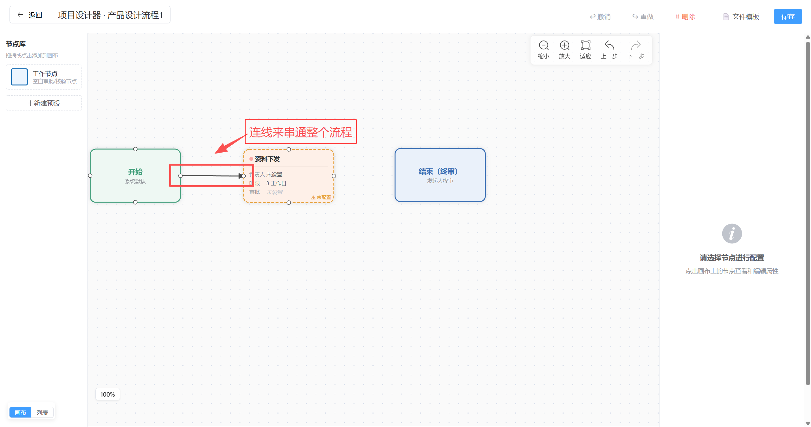

4. **⚡ 一键应用到全部节点**：配置好一个节点的人员后，点击属性面板「人员配置」区头部的「⚡ 一键应用到全部节点」按钮，当前节点的负责人/校验人/审批人/批准人会批量复制到所有工作节点，不用逐个设置。

> ⚠️ **重要**：第一个和最后一个节点由系统自动生成（开始节点 / 结束节点），你不需要手动创建。至少需要 3 个节点（含首尾）才能保存成功。

#### 3.1.4 保存模板

1. 点击左上角「保存设计」
2. 系统自动校验模板结构：节点 ≥3、中间节点均已配置校验人和审批人、所有节点连通
3. 校验通过则保存成功；不通过则提示具体错误（如"节点 X 未配置审批人"），修复后重新保存

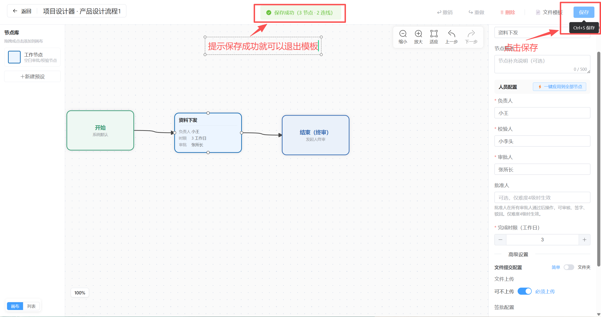

> 📌 保存后模板修改即时生效，不影响已经在运行的项目实例。

#### 3.1.5 节点预设

> 📌 如果你有常用的节点配置（比如"财务审批：张三负责 + 李四校验 + 王五审批 + 3天"），可以保存为预设，设计模板时直接拖出使用，不用每次重新配置。

**保存预设（两种方式）：**

- **方式一**：在画布上配置好一个节点 → 点击属性面板右上角「💾 保存为预设」
- **方式二**：在左侧节点库底部点击「新建预设」→ 在弹出的编辑窗口中手动填写


**预设中可配置的内容：**

| 配置项 | 说明 |
|--------|------|
| 预设名称 | 在节点库列表中显示的名字 |
| 节点名称 | 拖出后节点在画布上的默认名称 |
| 负责人 / 校验人 / 审批人 / 批准人 | 人员配置 |
| 时限 | 完成工作日数 |
| 文件提交配置 | 简单模式（是否必须上传）或文件夹模式（多个命名文件夹 + 各自规则） |
| 签批配置 | 各角色提交时是否需要签名 |


**使用预设：** 在节点库中点击预设卡片 → 预设节点自动添加到画布，所有配置已预填。也可以拖拽到画布。

**管理预设：** 鼠标悬停预设卡片 → 右上角出现 ✏️ 编辑和 🗑️ 删除按钮。预设属于个人，不影响其他用户。

> ⚠️ 如果预设中引用的用户已被管理员删除，系统会弹出提示，对应字段留空，其他配置正常带入。

#### 3.1.6 文件模板与模板包

> 📌 管理员可以上传标准文件模板（.docx/.xlsx），模板中可包含占位符（如 `{{项目名称}}`），用户下载时自动替换为实际值。

**关联模板到流程：** 在模板设计器中，点击顶部工具栏的「文件模板」按钮：


- **单个模板**：在「可用模板」列表中勾选，关联后出现在发起项目时的下载列表
- **模板包（分类）**：将多个模板打包为一个分类。关联分类后，分类下所有模板自动带入
- 已关联的模板/分类可随时取消关联

**发起时的使用：** 发起项目弹窗中（见 3.2 节），已关联的模板包默认全选，单个模板按需勾选。项目发起后，执行人在处理任务时可下载模板（占位符已自动替换）。

---

### 3.2 发起项目实例

> 📌 发起一个项目分为两步：① 在组织主页选模板 + 填业务信息 → ② 进入设计器确认节点配置 → 发起。

**步骤一：选择模板并填写业务信息**

1. 在项目管理页（组织卡片内），点击「发起项目」

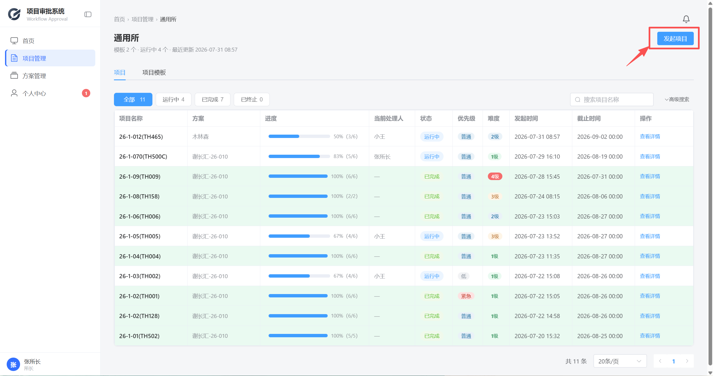

2. 在弹出的模板列表中搜索并选中一个模板（点击模板行即可选中）


3. 选中模板后，下方显示业务信息表单：

| 字段 | 说明 |
|------|------|
| **合同号** | 必填 |
| **产品型号** | 必填 |
| **销售经理** | 必填 |
| **关联方案** | 可选，关联一个已完成的方案 |

> 📌 项目名称由系统自动生成为「合同号(产品型号)」，在最终确认弹窗中可手动覆盖。

4. 点击「确认」→ 进入流程设计器（发起模式）


**步骤二：确认节点配置并发起**

进入设计器后（发起模式），你可以：

- 在画布上查看流程结构，点击节点在右侧属性面板调整**负责人、校验人、审批人、批准人**和**截止时间**
- 使用「⚡ 一键应用到全部节点」快速统一人员配置


确认无误后，点击右上角「发起项目」，弹出最终确认弹窗：

| 字段 | 说明 |
|------|------|
| **项目名称** | 自动生成（合同号+产品型号），可手动修改 |
| **优先级** | 紧急 / 高 / 普通 / 低，默认普通。发起后随时可改 |
| **难度等级** | 1-4 级，默认 1。选 4 级时每个节点需额外配置批准人 |
| **补充说明** | 选填 |
| **文件模板包** | 模板关联的模板包（见 3.1.6），默认全选，可取消不需要的包 |
| **文件模板** | 模板关联的单个文件模板，按需勾选 |


点击「确认发起」→ 系统创建流程实例，第一个工作节点的负责人立即收到任务。

### 3.3 查看项目详情

发起后进入项目详情页，包含三个核心区域：

**① 流程进度条（顶部）**：展示所有节点和当前进度。点击节点圆圈可展开对应卡片

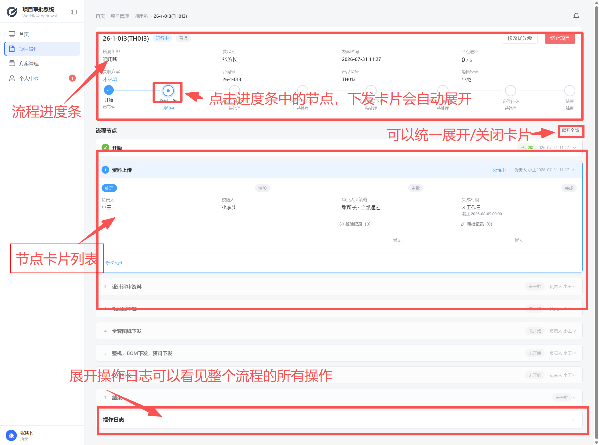

**② 节点卡片列表**：每个节点一张卡片，当前活跃节点高亮。卡面上有：
- 阶段进度（当前在第几步）
- 负责人/校验人/审批人信息
- 文件列表、校验记录、审批记录
- 操作时间线

**③ 操作日志时间线**：页面下方展示完整操作记录，按时间倒序排列

### 3.4 终止项目

> 📌 仅发起人可终止自己发起的项目（任意状态均可终止）。

1. 进入项目详情页
2. 点击右上角「终止项目」
3. 填写终止原因 → 确认

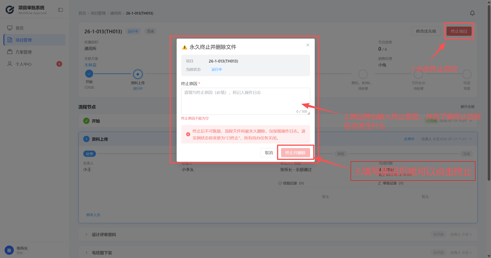

> ⚠️ 终止后项目内所有文件被删除，不可恢复。

### 3.5 紧急换人

> 📌 运行中项目的未完成节点，可以随时更换负责人/校验人/审批人。

1. 在项目详情页，找到需要换人的节点卡片
2. 点击节点右侧的「编辑」按钮
3. 修改对应的负责人/校验人/审批人
4. 点击确认 → 待处理的校验/审批记录自动更新，已完成的保留不动

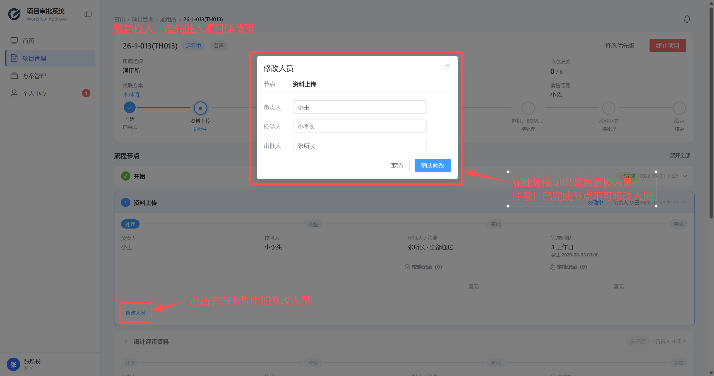

### 3.6 修改优先级

在项目详情页顶部信息区，点击优先级标签旁的修改按钮即可更换优先级。

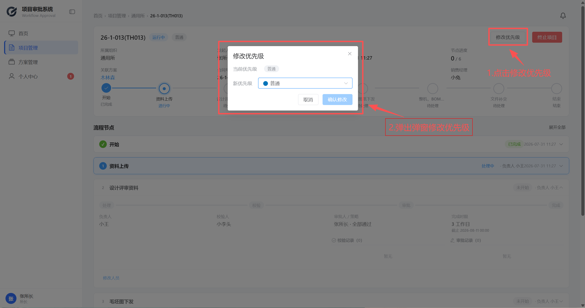

> 📌 发起人可随时修改优先级，无需走审批流程。节点截止时间在发起时设定，运行中不可修改。

### 3.7 方案管理

> 📌 方案（Proposal）和项目使用相同的节点模型，但更轻量——没有校验环节，只有设计人 + 审批人。

| 对比 | 项目 | 方案 |
|------|------|------|
| 节点流程 | 负责人→校验→审批→(批准)→下一节点 | 设计人→审批 |
| 文件要求 | 有文件分类/模板 | 同项目 |
| 发起位置 | 项目管理 → 进入组织 → 发起项目 | 方案管理 → 进入组织 → 创建方案 |
| 关联关系 | 发起项目时可关联一个已完成方案 | — |

发起方案的操作步骤和发起项目基本一致，参考 3.2 节。

### 3.8 当我被分配了执行任务

所长不只是发起流程——如果你把自己的名字配置进了节点的负责人、校验人、审批人或批准人，你也会收到待办通知。这些操作和普通用户完全一样，请参考：

| 操作 | 章节 |
|------|------|
| 处理待办任务（负责人） | 4.1 ～ 4.2 |
| 校验文件 | 4.3 |
| 审批通过 or 驳回 | 4.4 |
| 批准签阅 | 4.5 |
| 补交文件 | 4.6 |
| 上传签名图片 | 4.7 |

---

## 四、普通用户篇

### 4.1 我的待办——收到任务怎么做

当你是某个节点的负责人时，你会收到一个「待办任务」。

1. 在首页「我的待办」列表或导航栏角标上看到未处理数量


2. 点击进入「个人中心」→「我的任务」Tab


3. 找到对应任务，点击「详情」进入处理页面

### 4.2 上传文件 + 提交任务

进入任务详情页后：

1. 点击「上传文件」按钮，选择本地文件


> 📌 支持的文件类型：Word（.doc/.docx）、Excel（.xls/.xlsx）、PDF、常见图片格式（.png/.jpg/.jpeg），最大 50MB

2. 如果节点配置了文件分类（文件夹模式），上传时必须选择目标文件夹


3. 文件上传后可以预览、删除、重新上传
4. 文件确认无误后，点击「提交」


> 💡 提交时系统会自动将非 PDF 文件转为 PDF 格式，方便后续签批。转换需要几秒到几十秒。

5. 提交成功后，如果节点配置了校验人，他们会立即收到通知；如果没有校验人，审批人直接收到通知。

### 4.3 校验——同意 or 退回

当你是某个节点的校验人时，你会收到「校验」待办。

1. 进入「个人中心」→「我的校验」→ 点击「详情」


2. 在详情页查看节点信息和本轮所有文件


3. 有两个操作按钮：

| 操作 | 效果 |
|------|------|
| **通过** | 你这一关过了。所有人通过后，审批人收到通知 |
| **退回** | 任务退回给负责人。负责人修正后重新提交，校验流程重启 |

4. 可以填写意见（选填）

### 4.4 审批——通过 or 驳回

当你是某个节点的审批人时，你会收到「审批」待办。

1. 进入「个人中心」→「我的审批」→ 点击「详情」


2. 查看节点信息、所有文件和校验记录
3. 两个操作按钮：

| 操作 | 效果 |
|------|------|
| **通过** | 你这一关过了。所有人通过后签名上 PDF，进入下一节点 |
| **驳回** | 选择目标节点 → 该节点及之后的所有文件删除 → 目标节点负责人重新收到任务 |

4. **驳回时选择目标节点**：在弹出的列表中选择要退回的节点（只能选当前节点之前的工作节点）


5. 通过时可以调整签名在 PDF 上的位置（如已上传签名图片）

### 4.5 批准——难度 4 专属

> 📌 只有难度等级为 4 的项目/方案才会有批准环节。

批准和审批的区别：批准发生在所有审批人都通过之后。批准人可以同意，也可以驳回（退回给负责人重新处理）。

1. 进入「个人中心」→「我的批准」→ 点击「详情」


2. 查看文件、审批记录和签名情况
3. 点击「同意」→ 签名自动上 PDF → 节点完成

> 📌 批准人可以选择同意（签名上 PDF）或驳回（退回给负责人修正）。批准驳回后节点重新进入运行状态，负责人重新处理。

### 4.6 补交文件

> 📌 已完成项目的已完成节点，可以追加补充文件。

1. 进入项目详情页 → 找到已完成节点卡片
2. 点击「补交文件」按钮


3. 选择文件上传
4. 如果节点有文件分类配置，需要选择目标文件夹

> 📌 补交文件不会重启流程，只是追加归档。

### 4.7 上传签名图片

> 📌 审批通过后，系统可以将你的签名自动插入 PDF 指定位置。

1. 点击右上角头像 →「个人信息」


2. 在「签名图片」区域，点击上传


3. 签名图片要求：
   - PNG 透明底
   - 建议尺寸 200×60px
   - 小于 500KB

4. 上传后在任何需要签名的审批/批准页面都能自动使用

> 📌 如果不上传签名图片，审批/批准通过后 PDF 上不会添加你的签名（系统跳过签名步骤）。

---

## 五、系统管理员篇

> 📌 系统管理员只维护基础数据，不参与业务流程。左侧导航栏没有「个人中心」，只有「系统管理」。

### 5.1 用户管理

进入「系统管理」→「用户管理」Tab：


#### 新增用户

1. 点击「新增用户」
2. 填写用户名、真实姓名、选择角色


3. **组织选择规则**：
   - 如果选了「系统管理员」角色 → 组织可以留空（管理员不归属任何所）
   - 如果选了「所长」或「普通用户」→ 组织必选

4. 密码使用系统默认初始密码（由管理员在 `.env` 中配置），用户首次登录时强制修改。管理员需要将初始密码告知新用户

#### 编辑用户

1. 点击表格中的「编辑」
2. 用户名不可修改，其他信息可改
3. 修改角色后，组织必填规则同上

#### 启用/禁用

- 点击「禁用」→ 用户无法登录，已分配的待办任务不受影响
- 点击「启用」→ 恢复登录

#### 重置密码

- 点击「重置密码」→ 用户的密码恢复为系统默认初始密码，下次登录强制改密

### 5.2 组织管理

进入「系统管理」→「组织管理」Tab：


- **新增组织**：填写名称和描述
- **编辑组织**：可修改名称和描述
- **禁用组织**：禁用后该组织在流程设计时不可选择，但不影响已经使用的模板

### 5.3 系统配置

进入「系统管理」→「系统配置」Tab：


常用配置项：

| 配置项 | 说明 |
|--------|------|
| 允许的文件扩展名 | 控制哪些文件类型可以上传 |
| 最大文件大小 | 上传文件的大小上限（MB） |
| PDF 签名默认 X/Y 坐标 | 各角色签名在 PDF 上的默认位置 |
| 签名图片最大宽高 | 限制上传签名图片的尺寸 |
| 签名偏移量 | 同页多人签名时的水平间距 |
| 默认完成时限 | 节点没有单独设时限时的默认值（工作日） |

> 📌 修改后即时生效，不需要重启服务。

### 5.4 文件模板管理

> 📌 管理员可以上传标准文件模板（.docx/.xlsx），用户在项目中可以下载使用。

进入「系统管理」→「文件模板」Tab：


- **上传模板**：选择 Word 或 Excel 文件，指定所属组织
- **模板中的占位符**：模板文件里可以使用以下占位符，下载时系统自动替换：

```
{{项目名称}}    {{发起人}}      {{所属组织}}
{{发起日期}}    {{当前节点}}    {{优先级}}
{{难度等级}}    {{合同号}}      {{产品型号}}
{{销售经理}}    {{当前日期}}    {{处理人}}
{{节点名称}}    {{流程状态}}    {{项目编号}}
```

---

## 六、个人中心

> 📌 系统管理员没有个人中心。所长和普通用户可以在这里处理所有待办。

### 6.1 四个 Tab

进入「个人中心」，顶部有四个 Tab：

| Tab | 包含内容 | 对应角色 |
|-----|---------|---------|
| **我的任务** | 你作为负责人的待处理任务 | 负责人 |
| **我的校验** | 你作为校验人的待校验记录 | 校验人 |
| **我的审批** | 你作为审批人的待审批记录 | 审批人 |
| **我的批准** | 你作为批准人的待批准记录 | 批准人 |


每个 Tab 内是表格列表，显示项目名、节点名、优先级、截止时间。逾期行标红，临期（≤1天）行标黄。

### 6.2 我发起的项目

在个人中心底部有「我发起的项目」卡片，列出你发起的所有项目和方案（所有状态），可以快速跳转查看详情。

### 6.3 通知与角标

系统通过两种方式通知你：

1. **WebSocket 实时推送**：收到新任务/校验/审批/批准时，侧边栏「个人中心」菜单右上角出现红色角标数字

2. **30 秒轮询兜底**：即使 WebSocket 断开，个人中心页面每 30 秒自动刷新一次角标


| 角标位置 | 含义 |
|---------|------|
| 侧边栏「个人中心」 | 四项待处理总和 |
| 首页「项目/方案」Tab | 分类红点 |
| 个人中心四个 Tab 页签 | 各自待处理数 |

---

## 七、常见问题

### 7.1 被驳回后怎么重新提交

1. 你会在「我的任务」中看到一个新的待办（同一节点，新轮次）
2. 点击进入，会发现之前的文件已被清空
3. 修改内容后，重新上传文件 → 提交
4. 校验和审批流程全部重新开始

> 📌 重新提交后，通知列表里对应的驳回通知（审批驳回 / 批准驳回等）会自动消失，无需手动清理。「项目已终止」这类终局通知则点击后即删除。

### 7.2 截止时间过了怎么办

- 截止时间过期不会阻止你继续操作，你依然可以上传、校验、审批
- 但在项目列表和个人中心的表格中，你的记录行会标红提示
- 发起人（所长）可以随时修改截止时间，如有特殊情况请联系发起人调整

### 7.3 为什么我收不到审批通知

检查几个可能的原因：

1. **确认浏览器通知权限**：首次使用系统时浏览器会询问是否允许通知，请点击允许
2. **检查个人中心**：通知推送可能因网络问题中断，可以手动刷新个人中心页面查看
3. **确认自己是否真的被分配**：到项目详情页的节点卡片中，确认你的名字是否在审批人列表中
4. **前置步骤未完成**：如果上一个校验人还没通过，审批人不会收到通知。去项目详情页查看文章进度

### 7.4 文件上传失败怎么办

1. **检查文件类型**：确认是 .doc/.docx/.xls/.xlsx/.pdf/.png/.jpg/.jpeg 之一
2. **检查文件大小**：确认不超过 50MB
3. **检查文件名**：不要包含特殊字符
4. **转换失败**：如果 Word/Excel 文件转 PDF 失败，尝试先手动转为 PDF 再上传

### 7.5 如何查看流程走到了哪一步

进入项目详情页（从项目管理列表点击「查看详情」），顶部的流程进度条会清楚显示：

- **绿色完成**：已完成的节点
- **蓝色进行中**：当前正在处理的节点
- **灰色待处理**：还未到达的节点

点击任意节点圆圈可以直接展开该节点的详细卡片，看到负责人是谁、有哪些文件、谁已审批通过、谁还在等待。

### 7.6 签名没有出现在 PDF 上

1. 确认你已经上传了签名图片（参考 4.7 节）
2. 审批/批准时需要点击「通过」（不是驳回）
3. 如果节点配置中关闭了「要求签名」，即使上传了签名也不会插入 PDF
4. 签名图片格式需要是 PNG 透明底，大小不超过 500KB
